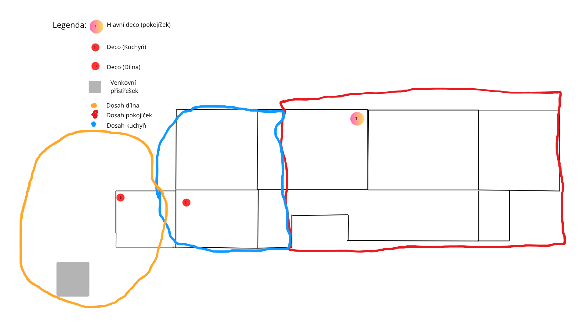
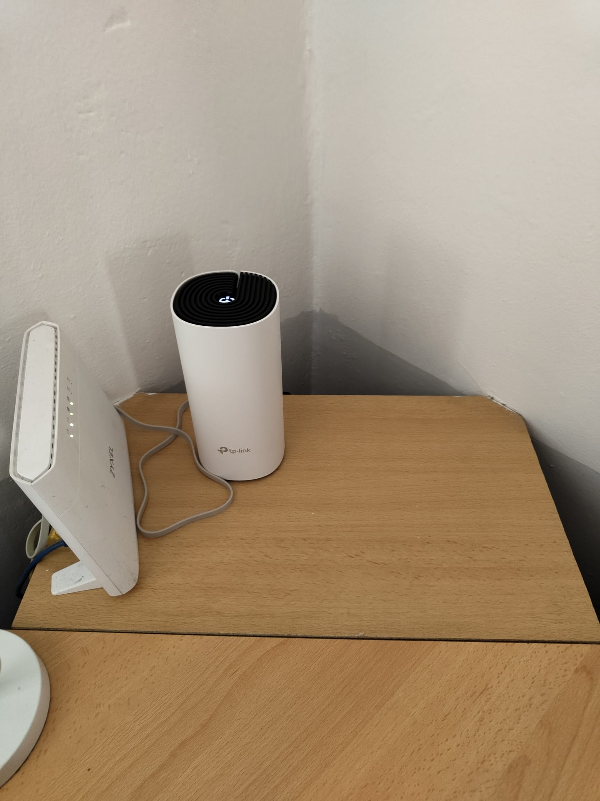
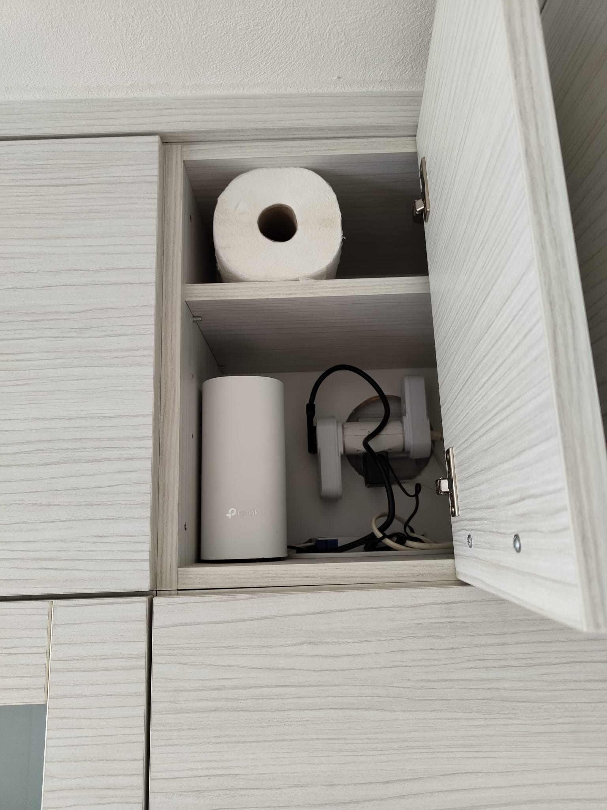
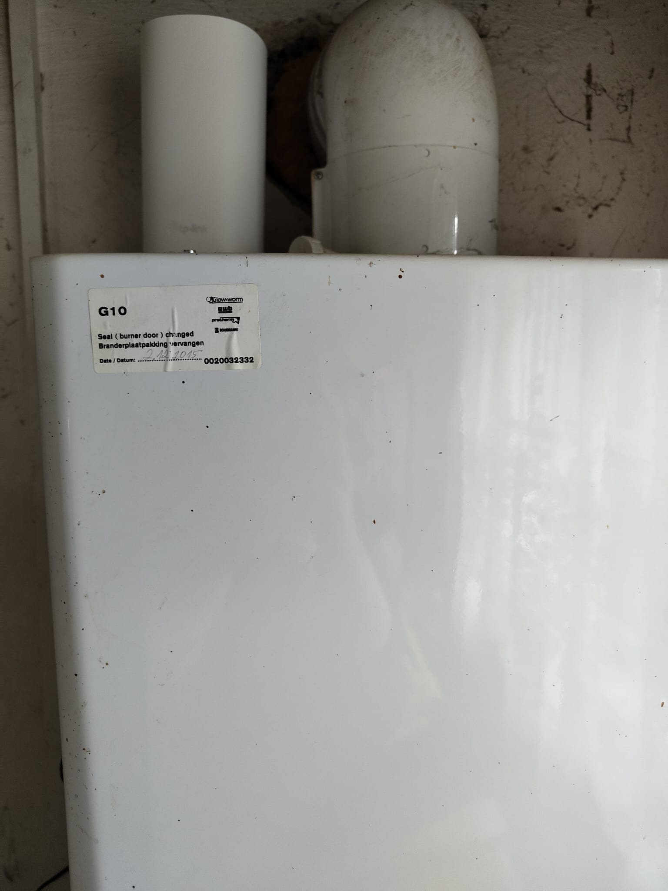

  <h1> Home Mesh Wi-Fi: TP-Link Deco M4</h1>
  
<i>Dokumentace návrhu, instalace a testování domácí mesh sítě</i>

<section id="introduction">
  <h2> Popis projektu</h2>
  

    Tento repozitář slouží jako dokumentace k řešení domácího internetového pokrytí. 
    Hlavním problémem byly "mrtvé zóny" v odlehlých částech domu a nestabilní přepínání 
    mezi staršími routery. Zvolil jsem technologii Mesh pro zajištění plynulého roamingu.
  

</section>

<section id="hardware">
  <h2> Výběr Hardwaru</h2>
  
Po analýze trhu jsem vybral <b>TP-Link Deco M4 (3-pack)</b>. Zvažoval jsem i následující alternativy:

  <table width="100%">
    <thead>
      <tr>
        <th>Model</th>
        <th>Hlavní přednost</th>
        <th>Proč nevybrán?</th>
      </tr>
    </thead>
    <tbody>
      <tr>
        <td><b>Mercusys Halo H50G</b></td>
        <td>Skvělá cena / Rychlost</td>
        <td>Chybějící podpora některých funkcí a méně stabilní SW.</td>
      </tr>
      <tr>
        <td><b>Asus ZenWiFi AC</b></td>
        <td>Extrémní dosah a nastavení</td>
        <td>Cena byla pro tento projekt příliš vysoká.</td>
      </tr>
      <tr>
        <td><b>Tenda Nova MW6</b></td>
        <td>Jednoduchost a cena</td>
        <td>Slabší propustnost při větším množství připojených zařízení.</td>
      </tr>
    </tbody>
  </table>

  <h4> Proč právě Deco M4?</h4>
  <ul>
    <li><b>Předchozí zkušenosti:</b> Mám skvělé reference od známých, kteří systém dlouhodobě provozují bez výpadků.</li>
    <li><b>Poměr cena/výkon:</b> V kategorii AC1200 nabízí nejlepší stabilitu za rozumnou pořizovací cenu.</li>
    <li><b>Estetika:</b> Vzhled jednotek je minimalistický a neruší design interiéru (důležité pro umístění v obytných místnostech).</li>
    <li><b>Ekosystém:</b> Velmi jednoduchá správa přes mobilní aplikaci a možnost budoucího rozšíření o další jednotky Deco.</li>
  </ul>
  
  <table width="100%">
    <thead>
      <tr style="background-color: #f2f2f2;">
        <th>Zvažovaný model</th>
        <th>Hlavní přednost</th>
        <th>Proč dostal Deco M4 přednost?</th>
      </tr>
    </thead>
    <tbody>
      <tr>
        <td><b>Mercusys Halo H50G</b></td>
        <td>Agresivní cena</td>
        <td>Deco má odladěnější software a spolehlivější podporu.</td>
      </tr>
      <tr>
        <td><b>Asus ZenWiFi AC</b></td>
        <td>Vysoký výkon</td>
        <td>Pro dané potřeby byl Asus zbytečně drahý.</td>
      </tr>
      <tr>
        <td><b>Tenda Nova MW6</b></td>
        <td>Design kostek</td>
        <td>Nižší stabilita při větším počtu připojených smart zařízení.</td>
      </tr>
    </tbody>
  </table>
</section>

<section id="implementation">
  <h2> Implementace a Plánování</h2>
  
  <h3>1. Náčrt domu a zóny pokrytí</h3>
  

    Na náčrtu níže jsou vyznačeny pozice jednotlivých jednotek (Deco 1, 2, 3) a jejich 
    přibližný dosah signálu v rámci domu.
  

  

  <h3>2. Reálné umístění (Detailní pohledy)</h3>
  

    Jednotky by měli být umístěny tak, aby nebyly v uzavřených prostorech (skříně apod.), 
    což maximalizuje efektivitu antén. Bohužel jsem však musel udělat vyjímku v kuchyni z důvodu špatně přístupných zásuvek.
  

  
  

    
    
    
     
    <small><i>Detailní pohledy na umístění jednotek (viz pozice v náčrtu).</i></small>
  

</section>

<section id="challenges">
  <h2> Problémy a výzvy při instalaci</h2>
  
  <h3>1. Vliv elektroinstalace na signál (Hliník vs. Měď)</h3>
  

    Během instalace jsme narazili na zajímavý technický fenomén. Dům má smíšenou elektroinstalaci, což se ukázalo jako klíčový faktor pro šíření signálu:
  

  <ul>
    <li>
      <b>Zóna s hliníkovým vedením:</b> Stará instalace způsobovala masivní rušení klasického routeru. V této části domu bylo nutné nasadit <b>2 jednotky Deco</b>, aby bylo dosaženo stabilního pokrytí.
    </li>
    <li>
      <b>Zóna s měděným vedením:</b> V pravé části domu (dle náčrtu), kde již proběhla rekonstrukce rozvodů na měď, je rušení minimální. Zde stačí <b>1 jednotka Deco</b> k pokrytí stejné plochy.
    </li>
  </ul>

  <h3>2. Estetika vs. Výkon (Umístění v kuchyni)</h3>
  

    Najít ideální místo v kuchyni byla výzva. Původní plán (stůl vedle kávovaru) byl zamítnut z estetických důvodů a kvůli absenci volných zásuvek.
  

  <blockquote>
    <b>Řešení:</b> Jednotka byla nakonec umístěna <b>do skříně</b>. I když to není z hlediska šíření vln ideální (fyzická překážka), testy potvrdily, že Deco M4 má dostatečný výkon na to, aby pokrylo plánovanou zónu i s touto rezervou.
  </blockquote>
</section>

<section id="results">
  <h2>  Naměřené výsledky (Speedtest)</h2>
  <ul>
    <li><b>Deco 1 (Pokojíček):</b> 50 Mbps / 10 Mbps</li>
    <li><b>Deco 2 (Kuchyň):</b> 50 Mbps / 10 Mbps</li>
    <li><b>Deco 3 (Dílna):</b> 25 Mbps / 5 Mbps</li>
  </ul>
</section>

<section id="thanks">
  <h3> Poděkování</h3>
  

    Speciální díky patří <b>Jakubu Daškovi</b> za pomoc s realizací, testováním a technickou podporou během celého procesu instalace.
  

</section>

<footer align="center">
  
Vytvořeno v roce 2026 jako dokumentace domácí sítě.

</footer>

